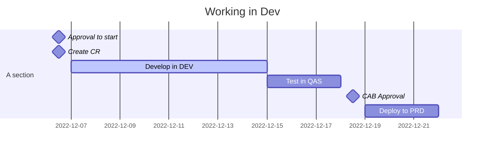
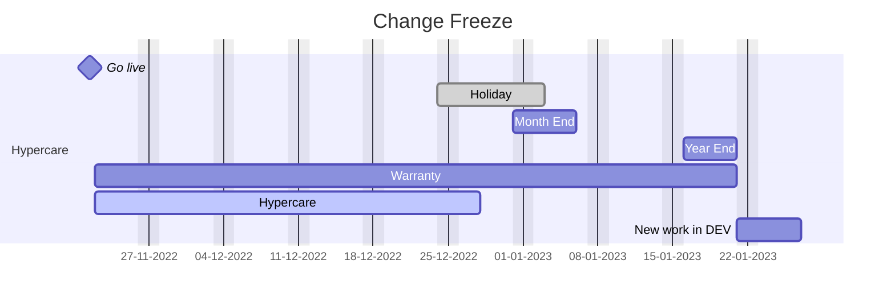

# Release Management Scenarios
## Change life-cycle

```mermaid
gantt
    dateFormat  YYYY-MM-DD
    title       Working in Dev

    section A section
    Approval to start : milestone, m1, 2022-12-06, 1d
    Create CR : milestone, cr, 2022-12-06, 1d
    Develop in DEV                 :active,    des1, 2022-12-07, 8d
    Test in QAS               :         des2, after des1, 3d
    CAB Approval                : milestone, m2, after des2, 1d
    Deploy to PRD              :         des3, after m2, 3d

```

## Change Freeze

```mermaid
gantt
    dateFormat  YYYY-MM-DD
    axisFormat  %d-%m-%Y

    title       Change Freeze
    excludes    weekends

    section Hypercare
    Go live : milestone, m1, 2022-11-21, 1d
    Holiday        :done, Warranty, 2022-12-24, 2023-01-03
    Month End              : monthend, 2022-12-31, 2023-01-06
    Year End              : yearend, 2023-01-16, 2023-01-21
    Warranty        : Warranty, after m1, 2023-01-21
    Hypercare        :active,    Hypercare, after m1, 2022-12-28
    New work in DEV              : after Warranty, 5d
    %%New work in DEV              : new, after Warranty + 2d, 3d

```

