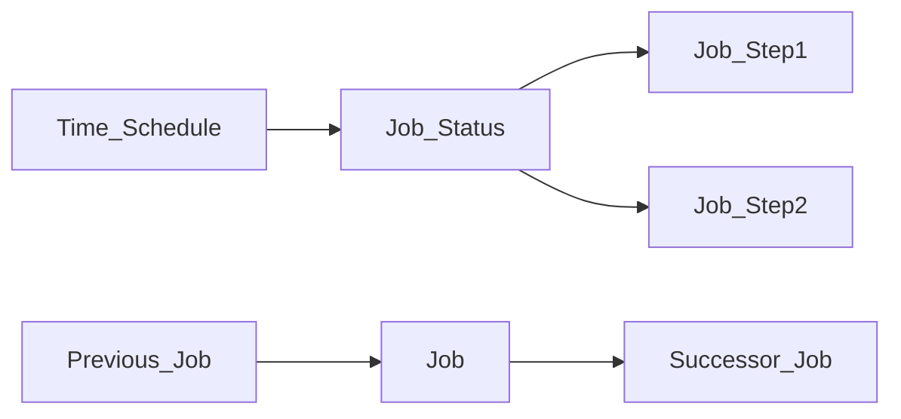
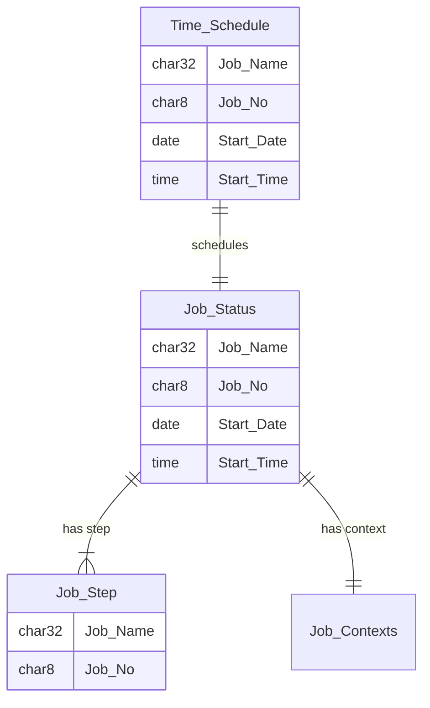

# Background Jobs
Use case
Background, or scheduled jobs run multiple step jobs on a schedule.  Each step runs a single program with a Variant.

SAP documentation for [S/4HANA](https://help.sap.com/docs/SAP_S4HANA_ON-PREMISE/8308e6d301d54584a33cd04a9861bc52/2c0e7c571fbeb576e10000000a4450e5.html?locale=en-US)

<!--Simplified conceptual Model -->
<!--Key objects and relationships to other key objects.  Try to show the ocntext of how this object is used. -->

Add Sequence diagram
## Background Jobs Concept


## Background Jobs
<!--Data Model -->
<!--Main objects only, only show any important fields -->

Job Status is table `TBTCO`
Each batch job run has exactly one entry in this table.
Job Step data is table `TBTCP`
Each batch job step has one entry in this table.
Job_Contexts is table `TBTCCNTXT`
Time_Schedule is table `TBTCS`
Jobs_Waiting_Event is table `BTCEVTJOB`

Program `BTCAUX14` List jobs by Frequency
See also other `BTCAUXnn` programs

TBTCO may contain 100Ks of records depending on the policy for deleting old records.
Typical query is to `Group by Job_Name, Count(Start_Date), Max(Start_Date)`.
Filter by `Status='F'` for successful, or `Status='A'` for aborted.
## Background Jobs - Data model
<!--Technical Data Model -->
<!--Any useful, show fields that are PK, FK, or any others.  May need multiple diagrams for detail-->
```mermaid
erDiagram


```  

<!--Describe key tables or special relationships -->
### Values for TBTCO-STATUS:

A - Cancelled
F - Completed
P - Scheduled
R - Active
S - Released
