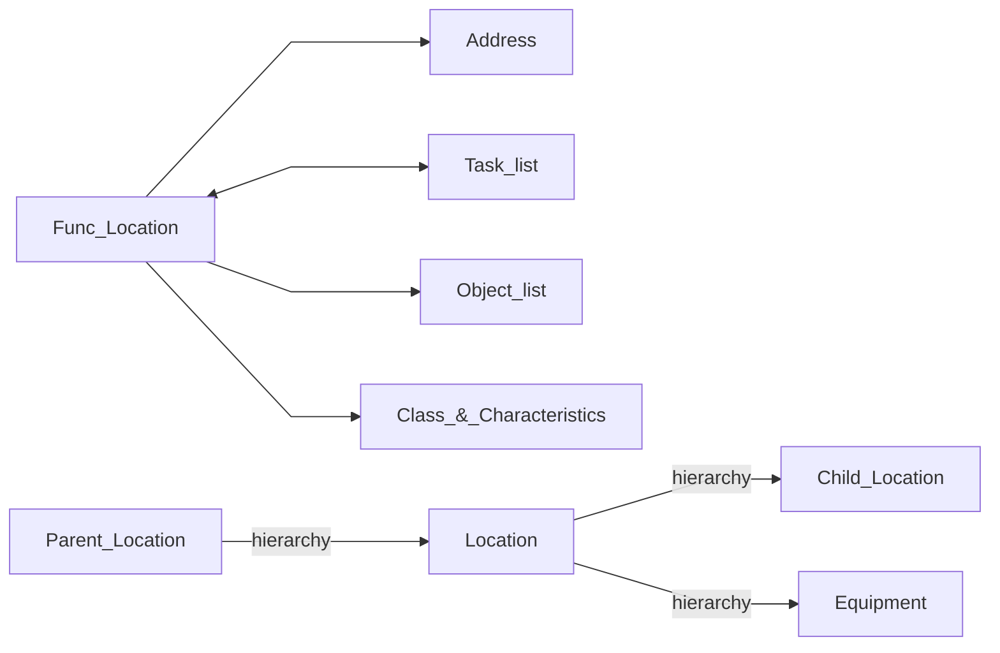
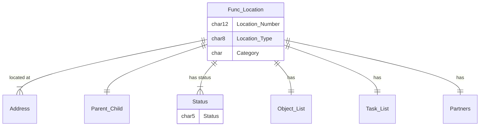
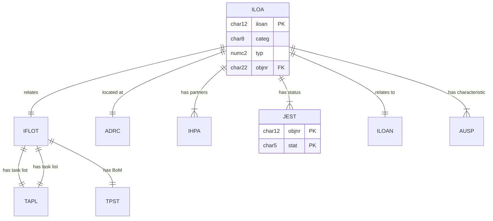

# Functional Location
Use case
Organise by Technology,Spatial etc
<!--Simplified conceptual Model -->
## Functional Location Concept

## Functional Location
<!--Data Model -->

Also related to Equipment, Order, Noti, Maintenance item, 

## Functional Location - Data model
<!--Technical Data Model -->

Note link to AUSP can be direct or via INOB when "Multiple Objects Allowed"
### ILOA Func_Location master data
iloan   103670748
objnr   OR000103670748

 many custom fields

### ADRC  Address
