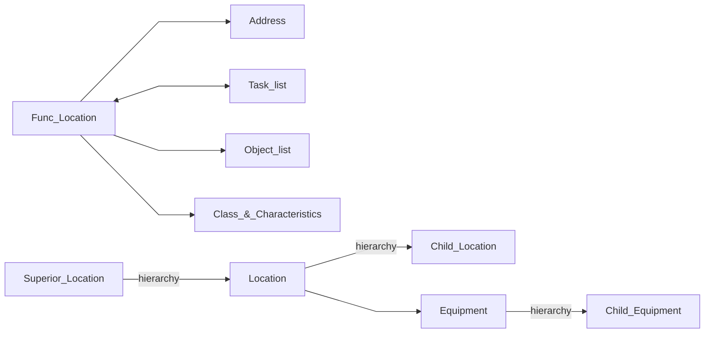
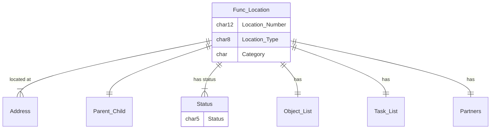
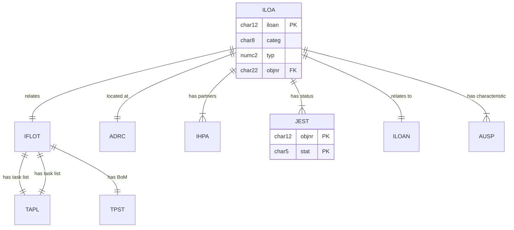

# Functional Location
This represents a physical or logical location used to locate the *Technical Objects* on which the Maintenance processes are based.
These can be structured by dimensions such as Function (purpose), Process, Technology, or Spatial/location.  The intial setup is flexible according to the above criteria, but the structure is typically permanent and expected to be retained for the lifetime of the plant or enterprise.

SAP documentation for [Functional Location](https://help.sap.com/docs/SAP_S4HANA_ON-PREMISE/e98c7c41bbe8439e90daa5c114a7573b/bed5b853dcfcb44ce10000000a174cb4.html?locale=en-US)
<!--Simplified conceptual Model -->
<!--Key objects and relationships to other key objects.  Try to show the ocntext of how this object is used. -->
## Functional Location Concept

## Functional Location
<!--Data Model -->
<!--Main objects only, only show any important fields -->

Also related to Equipment, Order, Noti, Maintenance item, 

## Functional Location - Data model
<!--Technical Data Model -->
<!--Any useful, show fields that are PK, FK, or any others.  May need multiple diagrams for detail-->

Note link to AUSP can be direct or via INOB when "Multiple Objects Allowed"

<!--Describe key tables or special relationships -->
### ILOA Func_Location master data
iloan   103670748
objnr   OR000103670748

### ADRC  Address
