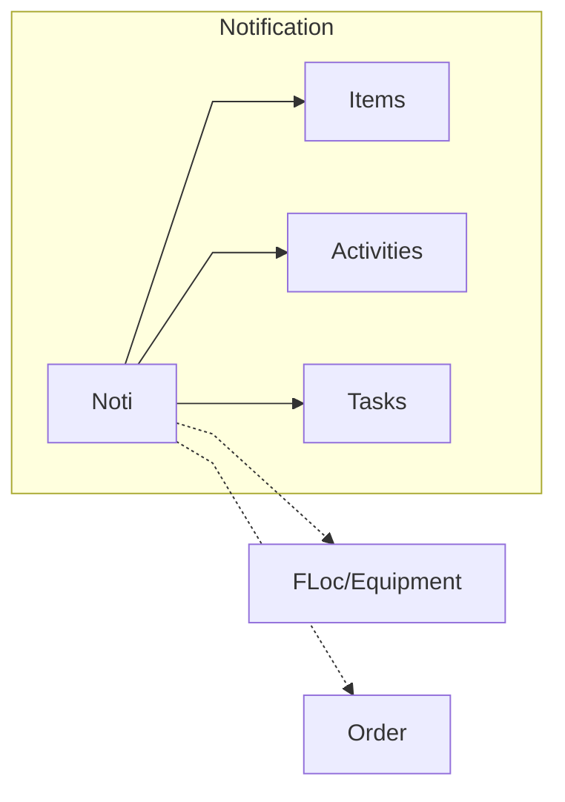
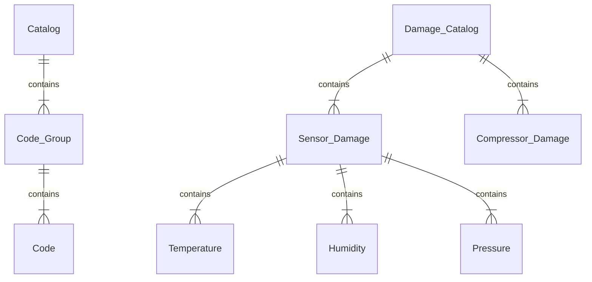
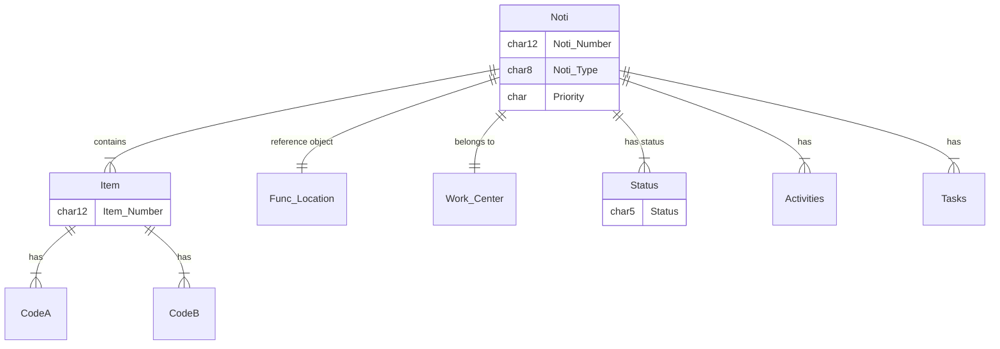

# Maintenance Notification (Noti) 
Maintenance Notification
: The Notification object represents a requirement for maintenance, as a description of defect or malfunction, and optionally related *Activities* or *Tasks*.  Typically it is related to a *Technical Object*, and is coded against Part, Damage, Cause codes for analysis purposes.

It can be used with an *Order*, or as a standalone object for simpler types of work.

## Maintenance Noti Concept 
<!--Simplified conceptual Model -->

## Maintenance Noti Catalog
<!--Data Model -->

## Maintenance Noti
<!--Data Model -->
TODO

Also related to ..

