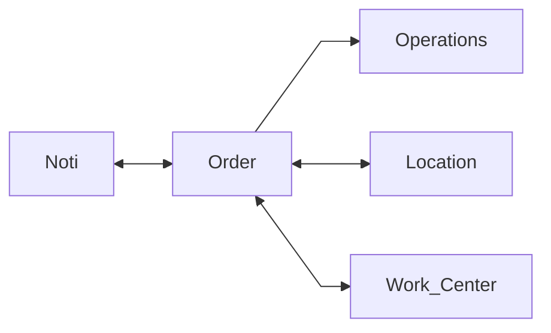
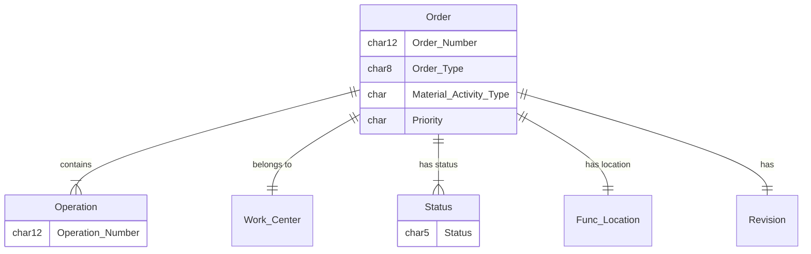
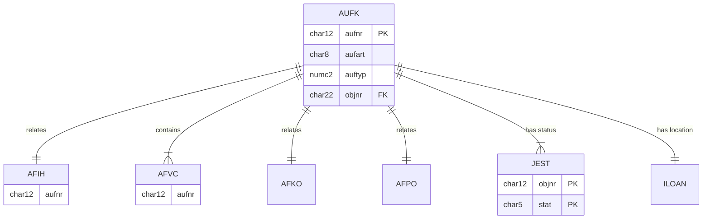

# Maintenance Order (Work Order) 
## Maintenance Order Concept 
<!--Simplified conceptual Model -->

## Maintenance Order (Work Order) 
<!--Data Model -->

Also related to Materials Reservations, Goods movements (AUFM), Noti

## Maintenance Order - Data model
<!--Technical Data Model -->

