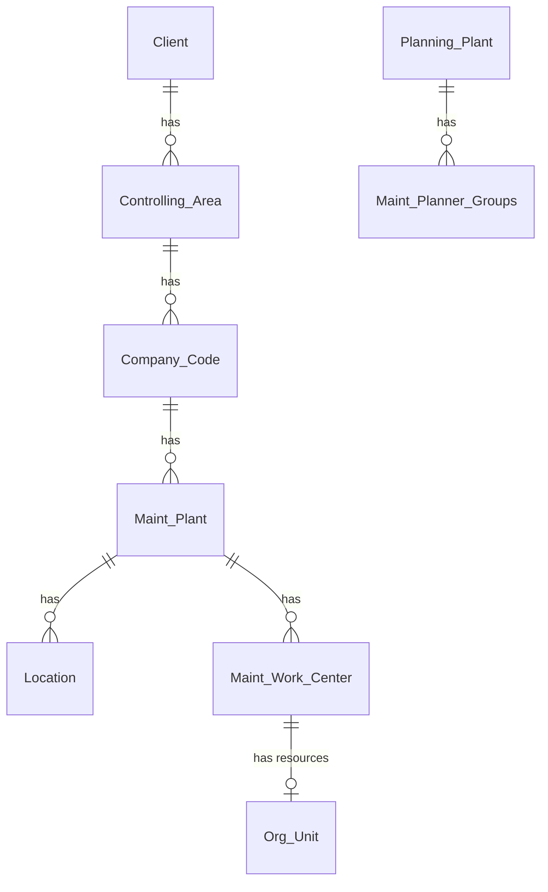
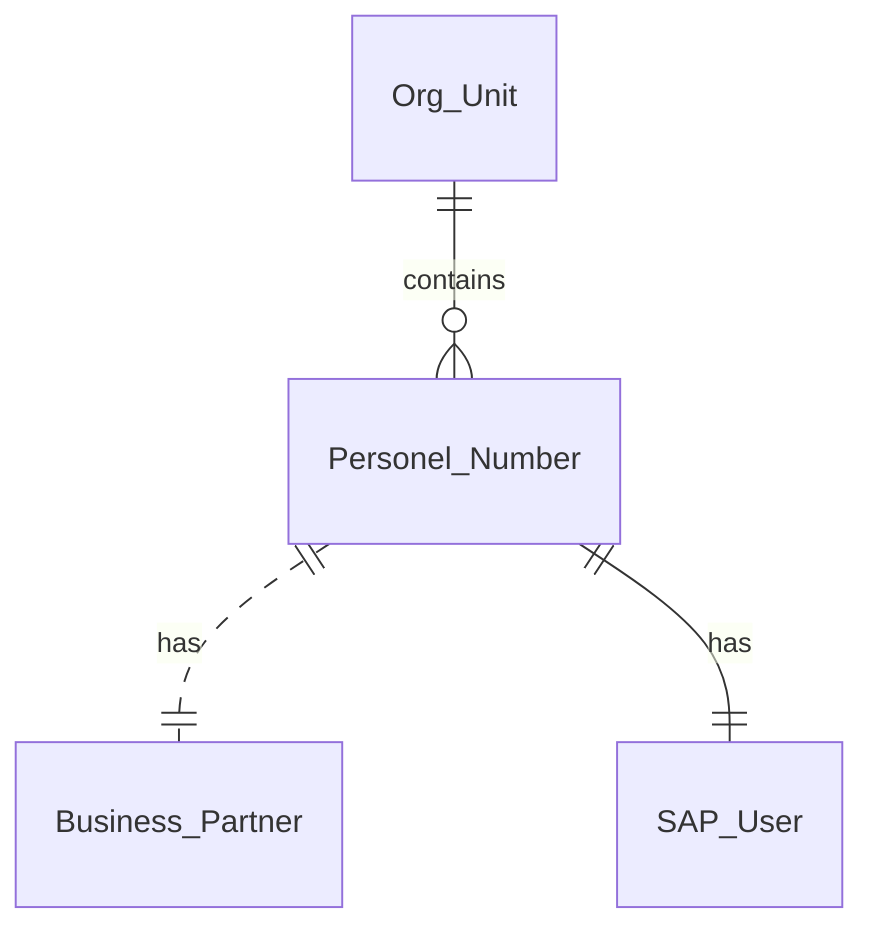

# Enterprise Structure & Organisational Objects
The PM module inherits from the overall *Enterprise Structure* which generally will implement one or more *Plant*. Consider these areas 
- General Enterprise
- Location-based
- Planning-based

## HR Organisational Units

The organizational levels are structured as follows:

Client
: The Client is the highest-level element of all the organizational units. This can represent a group of related Company Codes.  The Client also determines access to data at the database level.

Controlling Area
: One or more company codes can be assigned to a Controlling Area.  This allows Management Accounting (Controlling) to be performed over the group.

Company Codes
: The legal entities are configured as Company Codes. These can each have separate financial statements and balance sheets and transactions between these are inter-company.

Plant
: The Plant is a logical grouping or location for the systems & assets (plant) of the company.  This is also called the *Maintenance plant*.

Planning Plant
: If there is a single plant, then the *Maintenance plant* is also the *maintenance planning plant*. A maintenance plant can be split into logical locations, using sites, buildings, or regions. It can also be split into plant sections based on organisational and financials lines. 
The *Maintenance Planning Plant*, or *Planning Plant* is the organizational unit for planning maintenance. The planning can be for that Plant, or for another related Plant.  The planning function is further split into *Maintenance Planner groups*.

Maintenance Work Centers
: Work Centers are functional and logistical groups that perform the work, and where capacity, skills and unit costs are managed. Maintenance work centers are assigned to a Maintenance Plant.

Organizational Unit
: The Organizational Units (Org Unit) are hierarchical elements, like teams, departments or positions, that are used in the HR (Human Resources) module to represent an organizational structure. Employees are assigned to organizational units, and in turn, units are assigned to work centers. 

Personnel Number
: The Personnel Number, PerNo, is the object or identifier for an employee and their data.

Business Partner
: The Business Partner (BP) is a flexible obect and data structure for master data such as persons, teams and organizations. There is a BP object for each Supplier, Customer, or Employee/PerNo.

SAP User
: The user is the logical identifier for a physical person (PerNo), or technical (system) account, who can logon to a system.  This determines the access granted and authentication with the enterprise directory.  Programs, jobs and processes are executed by a unique User.