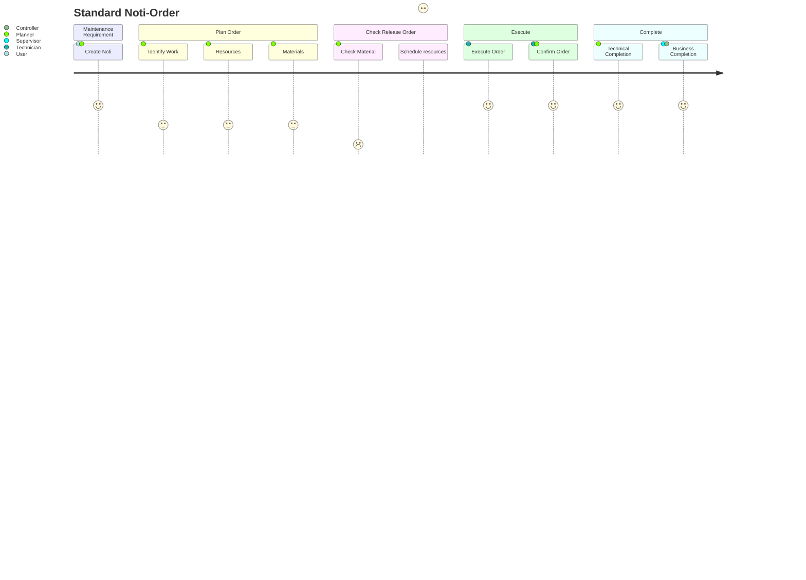

# Maintenance Process - Standard 
Standard Process
: Uses Notis linked to Maintenance Orders and can be used for many purposes, including reactive/breakdowns, or proactive/planned work.

## Process Flow 
<!--Simplified process flow -->

## User Journey
<!--Simplified process flow -->

