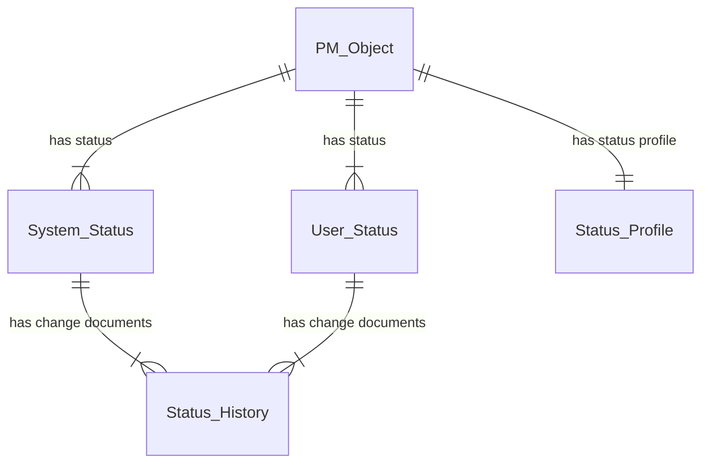
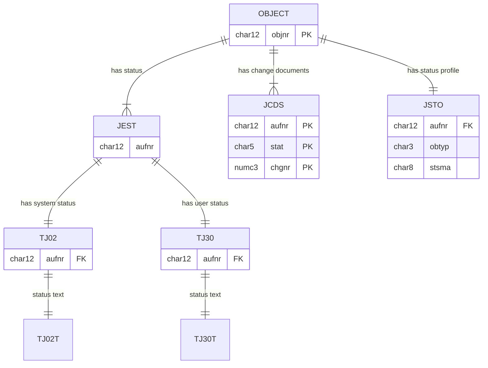

# System and User Status
PM_Object can be any of Noti, Order, Operation, Floc, Equi, Maintenance Plan
System status represent the stage in the object life-cycle and determine the behaviour of the object.
User Status can be defined in configuraton, and can be multiple and a defined sequence(state machine).

### JEST Individual Object Status
Contains list of System and User status records both active and inactive

### JCDS Change Documents for System/User Statuses (Table JEST)
Contains historic list of System and User status changes with user, date, time, TCode, etc.

### JSTO Status object information
Shows the Status Profile for the objnr 

OR000103670748	E0012		1	
OR000103670748	E0051	X	2	
OR000103670748	E0061		1	
OR000103670748	I0001	X	1	
OR000103670748	I0002		1	
OR000103670748	I0016		1	
OR000103670748	I0028		1	
OR000103670748	I0118	X	1	
OR000103670748	I0215		1	
OR000103670748	I0420	X	1	
OR000103670748	I0485		1	

