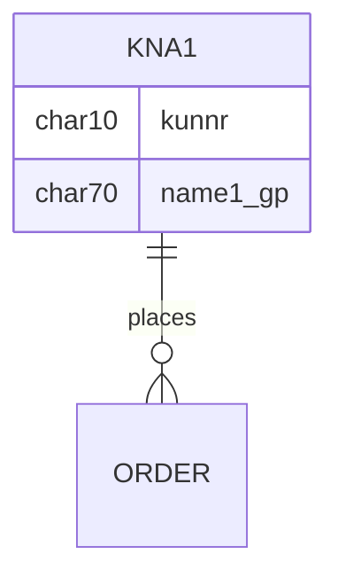

# Customer 

KNA1 General Data

KNB1 Customer Master u2013 Co. Code Data (payment method, reconciliation acct)

KNB4 Customer Payment History

KNB5 Customer Master u2013 Dunning info

KNBK Customer Master Bank Data

KNKA Customer Master Credit Mgmt.

KNKK Customer Master Credit Control Area Data (credit limits)

KNVV Sales Area Data (terms, order probability)

KNVI Customer Master Tax Indicator

KNVP Partner Function key

KNVD Output type

KNVS Customer Master Ship Data

KLPA Customer/Vendor Link