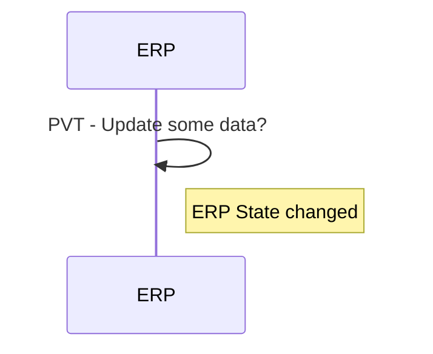
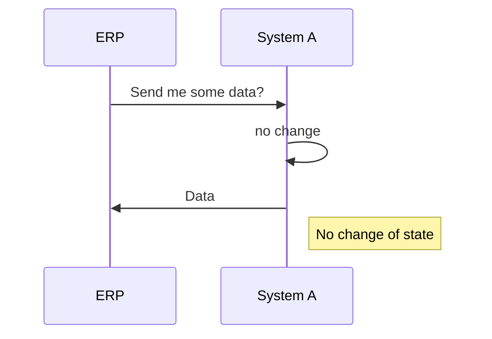
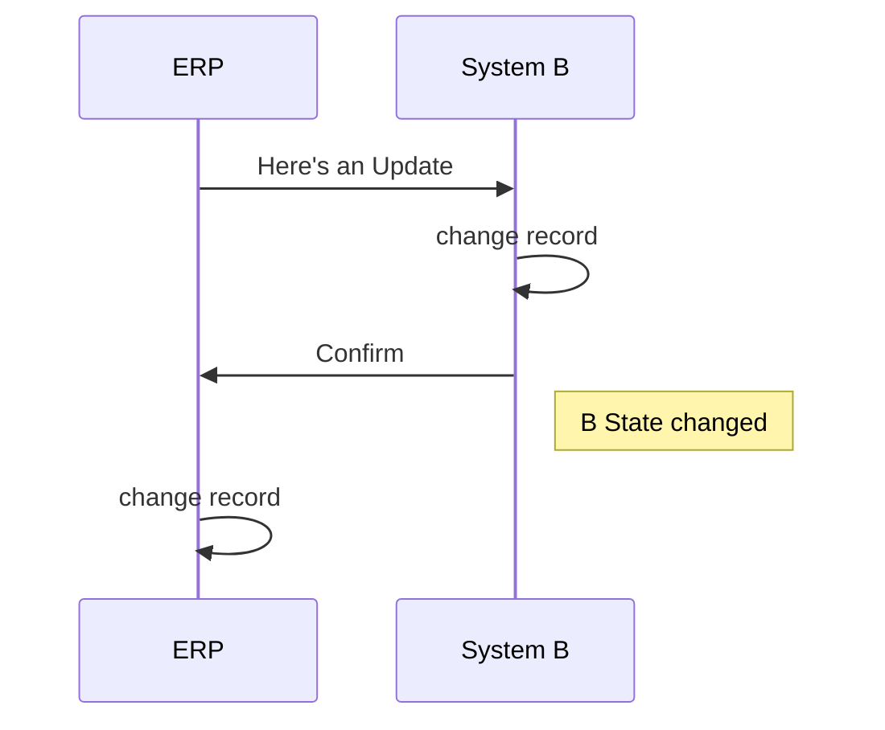
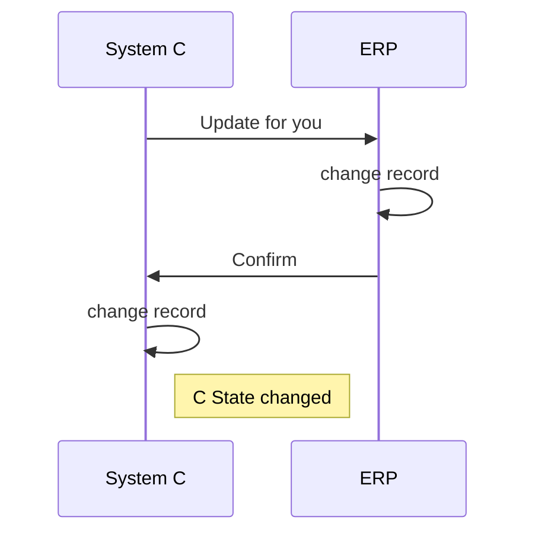

# Integration Scenarios
## No external impact, OK for PVT

```mermaid
sequenceDiagram
ERP->> ERP: PVT - Update some data?
Note right of ERP: ERP State changed
```

## Read from A, OK for PVT

```mermaid
sequenceDiagram
ERP->>System A: Send me some data?
System A ->> System A: no change
System A ->> ERP: Data
Note right of System A: No change of state
```

## Transactional Write to B, Not allowed for PVT

```mermaid
sequenceDiagram
ERP->>System B: Here's an Update
System B ->> System B: change record
System B ->> ERP: Confirm
Note right of System B: B State changed
ERP ->> ERP: change record
```
## Transactional Write to ERP, Not allowed for PVT

```mermaid
sequenceDiagram
System C->>ERP: Update for you
ERP ->> ERP: change record
ERP ->> System C: Confirm
System C ->> System C: change record
Note right of System C: C State changed
```
