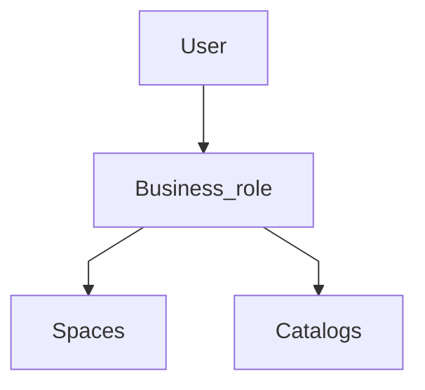
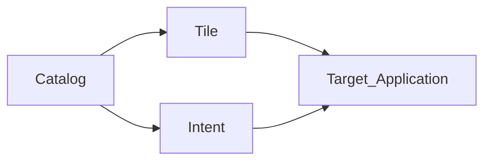
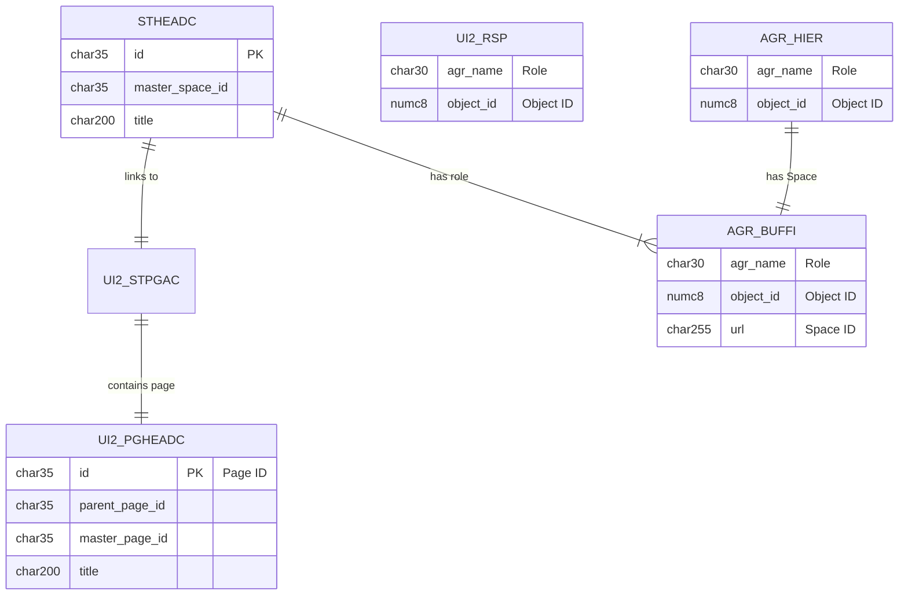

# Space and Page

Use case
Organise by Technology,Spatial etc
<!--Simplified conceptual Model -->
## Space and Page Conceptual
Role may have multiple Spaces; Space may be in multiple Roles.
Catalog determines what applications and Tiles can be used, and intent-based navigation.
Spaces determine layout.

## Space and Page Data Model

### AGR_HIER Internet Links for a Role

### AGR_BUFFI Internet Links for a Role

# Package /UI2/FDM
open in SE80 to browse
## Package /UI2/FDM_SPACE
### View /UI2/RSP
where AGR_HIER.REPORT = 'SPACE_PROVIDER'
and AGR_BUFFI.URL != ''

### Table /UI2/STPGAC FLP Space: Space - Page Assignment - Customizing 

## Package /UI2/FDM_PAGE
### Table /UI2/PGHEADC FLP Page: Page - Customizing 

Role ZSAP_FXXX_R2R_AR-INCMG-PYMT
Space SAP_SFIN_SP_AR_ACC

/UI2/FDM_SPACE  Space Repository

/UI2/SPACE_ENTITY_ID
/UI2/RSP       Role space assignment

/UI2/ST_BC_SCOPE               Fiori Launchpad Space Template: Business C
/UI2/STHEAD                    FLP Space: Space Template
/UI2/STHEADC                   FLP Space: Space - Customizing
/UI2/STHEADCT                  FLP Space: Space Texts - Customizing
/UI2/STHEADT                   FLP Space: Space Template Texts
/UI2/STPGA                     FLP Space: Space Template - Page Template
/UI2/STPGAC                    FLP Space: Space - Page Assignment - Custo
/UI2/SYSALIASCAT               UI2: Catalog System Alias Mapping
/UI2/SYSALIASCT                UI2: Catalog Texts
/UI2/SYSALIASMAP               UI2: System Alias Mapping

Page Tables

/UI2/PG_BC_SCOPE               Fiori Launchpad Page Template: Business Co
/UI2/PGHEAD                    FLP Page: Page Template
/UI2/PGHEADC                   FLP Page: Page - Customizing
/UI2/PGHEADCT                  FLP Page: Page Texts - Customizing
/UI2/PGHEADT                   FLP Page: Page Template Texts
/UI2/PGSEC                     FLP Page: Page Template Section
/UI2/PGSECAI                   FLP Page: Page Template Section Assignment
/UI2/PGSECAIC                  FLP Page: Page Section Assignment Item - C
/UI2/PGSECAITI                 FLP Page: Page Template Section Assignment
/UI2/PGSECAITIC                FLP Page: Page Section Assignment Item: Ti
/UI2/PGSECC                    FLP Page: Page Section - Customizing
/UI2/PGSECCT                   FLP Page: Page Section Texts - Customizing
/UI2/PGSECT                    FLP Page: Page Template Section Texts