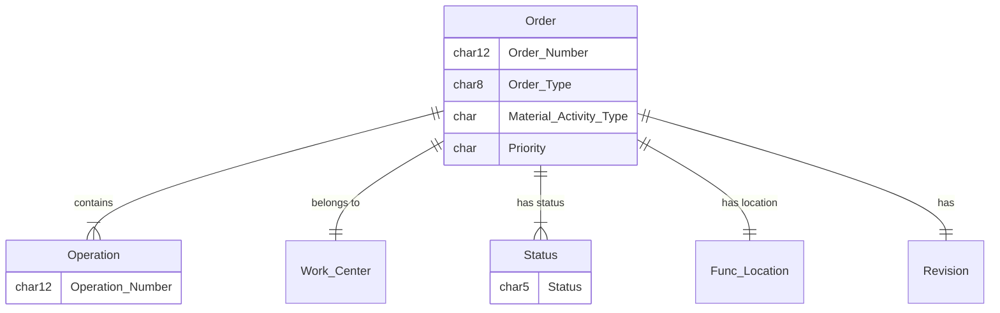

# SAP Diagrams


*A collection of pre-built diagrams for SAP ERP, ECC S/4HANA and related systems.*

<!--
[

> **Note:** Some observations if you need them (optional).
-->

## Features

* Diagrams and notes for SAP data models and other SAP scenarios.
* A personal collection of re-usable diagrams tht can be freely used in your documentation and presentations.
* Useful for Functional consultants, Developers, Project Managers working with SAP ERP.
* A reference for SAP Certification, intended to have a similar scope and structure when complete. 
* Uses simple text-based Markdown files.
* Based on the popular [Mermaid](https://mermaid-js.github.io/mermaid/#/) tool, these diagrams are quick to customise and adapt to your situation.  

The layouts are automatically generated from the text, and the benefit is that they can be quickly edited and adapted.  The layout cannot be fine-tuned, but there are directives and CSS styling available within the Mermaid tools.

## Example

### User Journey for Standard Maintenance Process

```

journey
    title Standard Noti-Order 
    section Maintenance Requirement 
      Create Noti: 5: User, Planner
    section Plan Order
      Identify Work: 3: Planner
      Resources: 3: Planner
      Materials: 3: Planner
    section Check Release Order
      Check Material: 1: Planner
      Schedule resources: 1: Planner
    section Execute
      Execute Order: 5: Technician
      Confirm Order: 5: Technician, Planner
    section Complete
      Technical Completion: 5: Planner
      Business Completion: 5: Supervisor, Controller
```


### Maintenance Order (Work Order) 
<!--Data Model -->

</div>

## Quick start

To work on a local PC:
Use VS Code or another IDE or developer's editor. 
With VS Code, install a Markdown previewer like [this](https://marketplace.visualstudio.com/items?itemName=shd101wyy.markdown-preview-enhanced).
Clone the repo locally.

Or to work online:
Use the popular Mermaid [Live Editor](https://mermaid-js.github.io/mermaid-live-editor).
Copy the .md files that you need directly into the Editor and modfiy as needed.
Export in common formats.

Embed diagrams


## Contents
|                  |  Master Data       | Transactional        |          Description            |
| :--------------- | :----------------: | :------------------: |  :-------------------------------- |
| [PM / EAM ](./ERP/PM/index.md)   | ✓ |  ✓ | Plant Maintenance, Asset Management. |
| MM      |  |    | Materials Management, Supply Chain. |
| SD                               |  |    | Sales, Billing. |
| [Integration](./Int/index.md)    | ✓ |    | Interfaces, integration with other systems. |
| [UI](./UI/index.md)       |  |    | User Interface technologies, UI5/Fiori, FLP, GUI.  |
| Deploy                    |  |    | Deployment, Transports, Environments.  |

✅ Complete
✓ In progress


## To Do
Further diagrams will be added over time, as they are found useful in my work.
If you are looking for something in particular, create a request in an Issue.

## Contributing [](https://github.com/qurm/sap-diagrams/issues)

Thank you for considering contributing to SAP Diagrams.

We welcome any type of contribution, not only code. You can help with:
- **Review**: Review the diagrams, and feedback any gaps or corrections.
- **Contribute**: Add new diagrams in a similar style, either paste into an Issue, or as a Pull request.  See the templates folder for examples of the preferred style.
- **Issues**: Request diagrams via an Issue, or look at the [open issues](https://github.com/qurm/sap-diagrams/issues) and comment on them, showing what is interesting to you.

## References

https://mermaid-js.github.io/mermaid/#/README
https://www.markdownguide.org/
https://github.github.com/gfm/


<!--copyright--->
