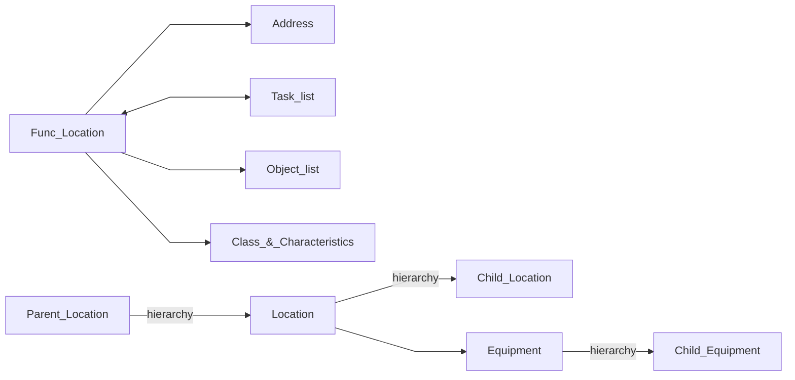
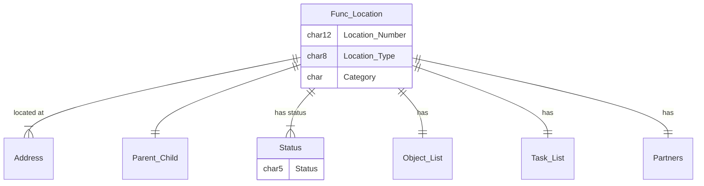
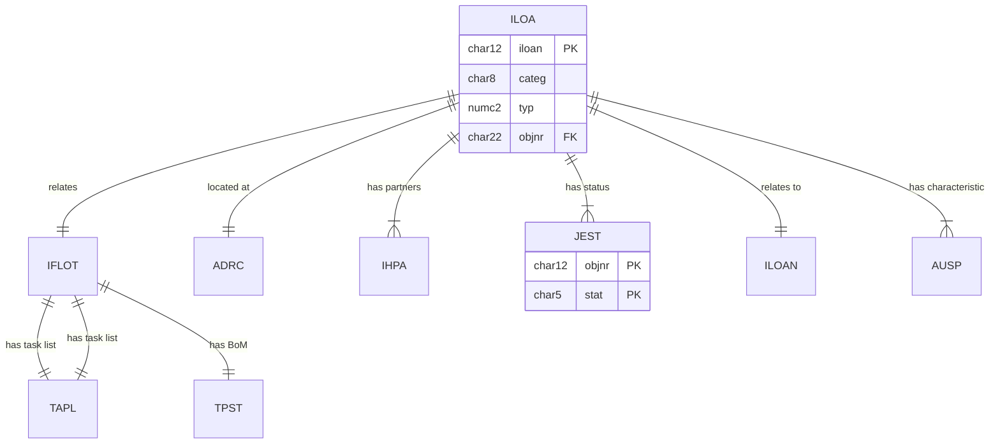

# Functional Location
Use case
Organise by Technology,Spatial etc
<!--Simplified conceptual Model -->
<!--Key objects and relationships to other key objects.  Try to show the ocntext of how this object is used. -->
## Functional Location Concept

## Functional Location
<!--Data Model -->
<!--Main objects only, only show any important fields -->

Also related to Equipment, Order, Noti, Maintenance item, 

## Functional Location - Data model
<!--Technical Data Model -->
<!--Any useful, show fields that are PK, FK, or any others.  May need multiple diagrams for detail-->

Note link to AUSP can be direct or via INOB when "Multiple Objects Allowed"

<!--Describe key tables or special relationships -->
### ILOA Func_Location master data
iloan   103670748
objnr   OR000103670748

### ADRC  Address
